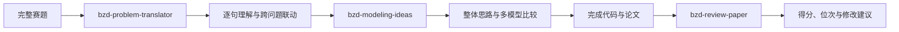

# BZD Math Modeling Skills

面向数学建模竞赛的 BZD Skills 合集，支持 **Codex** 与 **Claude Code**。

本项目围绕数学建模竞赛的完整流程进行研发，目前覆盖赛题逐句理解、整体建模思路生成、多模型比较与选型、论文评审和竞赛位次预估。相关 Skills 主要基于2020—2025年高教社杯全国大学生数学建模竞赛赛题、评分细则、评分要点、评阅概述及完整评阅流程进行归纳和蒸馏。

后续将继续增加数据预处理、模型验证、代码检查、论文写作和图表审查等数学建模 Skills。

## Skills

| Skill | 主要作用 | 输入 | 输出 |
|---|---|---|---|
| [`bzd-problem-translator`](skills/bzd-problem-translator/) | 逐句解释赛题，识别隐含条件和跨问关系 | 完整赛题及附件说明 | 题意翻译报告、跨问题联动链 |
| [`bzd-modeling-ideas`](skills/bzd-modeling-ideas/) | 生成贯穿全文的建模主线并比较可行模型 | 赛题、附件、可选题意报告 | 多模型比较、选型理由、创新与验证方案 |
| [`bzd-review-paper`](skills/bzd-review-paper/) | 根据赛题制定细则并评审论文 | 竞赛类型、完整赛题、完整论文 | 百分制得分、预估位次、HTML评审报告 |

## 推荐工作流



## 安装

### Codex

下载仓库后，将需要的 Skill 文件夹复制到：

```text
Windows：%USERPROFILE%\.codex\skills\
macOS/Linux：~/.codex/skills/
```

安装全部后，目录示例：

```text
.codex/skills/
├── bzd-problem-translator/
├── bzd-modeling-ideas/
└── bzd-review-paper/
```

### Claude Code

将需要的 Skill 文件夹复制到：

```text
项目目录/.claude/skills/
```

评审 Skill 的Claude Code补充配置见 [`integrations/claude-code/`](integrations/claude-code/)。

## 调用示例

```text
使用 $bzd-problem-translator 翻译以下完整赛题：<赛题路径>
```

```text
使用 $bzd-modeling-ideas 分析以下完整赛题：<赛题路径>
请生成贯穿全文的整体思路，并比较每一问的可行模型和选型理由。
```

```text
使用 $bzd-review-paper 评审：
竞赛类型：<是否为高教社杯国赛或其他竞赛名称>
赛题：<赛题路径>
论文：<论文路径>
```

## 项目结构

```text
bzd-math-modeling-skills/
├── README.md
├── CHANGELOG.md
├── skills/
│   ├── bzd-problem-translator/
│   ├── bzd-modeling-ideas/
│   └── bzd-review-paper/
└── integrations/
    └── claude-code/
```

## 重要说明

- 本项目不是竞赛官方工具，输出不代表官方评审结果或奖项承诺；
- 没有真实附件数据时，不应虚构模型参数、最优结果和预测精度；
- 使用者应自行确认竞赛关于AI工具、论文格式和学术诚信的最新规定；
- 请勿向公开仓库提交未公开论文、个人身份信息、API Key或无传播授权的内部材料。

## 联系方式

✨ 如需进一步详细的论文检查、赛中资料等服务，可关注 **BZD数模社** 官网：[https://bzdshumo.com/](https://bzdshumo.com/)

- QQ数模交流群（主群1）：689964173
- QQ数模交流2群（主群2）：275032074
- 资料通知群（仅推送资料/无聊天）：928949323
- 微信（个性化定制）：bzdsxjm521
- 备用微信：bzdsxjm520 / BZD661188
