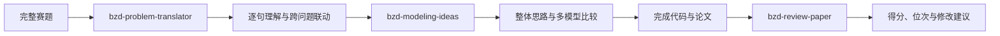

# BZD Math Modeling Skills

面向数学建模竞赛的 BZD Skills 合集，支持 Codex 与 Claude Code。
本项目围绕数学建模竞赛的完整流程进行研发，目前覆盖赛题逐句理解、跨问题关系梳理、整体建模思路生成、多模型比较与选型、论文评审、竞赛位次预估、高校国奖数据查询及个人备赛进度评估。
相关 Skills 主要基于2020—2025年高教社杯全国大学生数学建模竞赛赛题、评分细则、评分要点、评阅概述及完整评阅流程进行归纳和蒸馏。
后续将继续增加数据预处理、模型验证、代码检查、论文写作和图表审查等数学建模 Skills。
## Skills

| Skill | 主要作用 | 输入 | 输出 |
|---|---|---|---|
| [`bzd-problem-translator`](skills/bzd-problem-translator/) | 逐句解释赛题，识别隐含条件和跨问关系 | 完整赛题及附件说明 | 题意翻译报告、跨问题联动链 |
| [`bzd-modeling-ideas`](skills/bzd-modeling-ideas/) | 生成贯穿全文的建模主线并比较可行模型 | 赛题、附件、可选题意报告 | 多模型比较、选型理由、创新与验证方案 |
| [`bzd-review-paper`](skills/bzd-review-paper/) | 根据赛题制定细则并评审论文 | 竞赛类型、完整赛题、完整论文 | 百分制得分、预估位次、HTML评审报告 |
| [`bzd-cumcm-school-awards`](skills/bzd-cumcm-school-awards/) | 查询高校五年国奖数据并评估个人备赛差距 | 学校名称、赛区及个人竞赛经历 | 高校国奖画像、2026预测及备赛建议 |
| [`bzd-abstract-checker`](skills/bzd-abstract-checker/) | 仅输入摘要，检查独立阅读性及具体写作问题 | 数学建模论文摘要，可选题目与关键词 | 严重问题警告、逐项观察、问题清单及优先修改建议 |
## Skills 介绍

### BZD-review-paper

面向数学建模竞赛论文的智能评审 Skill，支持 **Codex** 与 **Claude Code**。本项目使用2020—2025年16道高教社杯全国大学生数学建模竞赛题目的评分细则、评分要点、评阅概述及完整评阅流程蒸馏形成，主要适用于高教社杯国赛论文评审。

用户只需提供完整赛题和参赛论文，Skill 会先根据赛题独立制定百分制评分细则，再对论文逐项评审，计算最终得分与竞赛位次，并生成可直接查看、打印或保存为 PDF 的 HTML 评审报告。

### Modeling Ideas

Modeling Ideas 是一款基于过去五年国赛赛题与评委标准答案蒸馏而成的思路生成工具。输入题干后，它不直接给出单一答案，而是先将题目翻译为“已知 x、构建 f(x)、输出 y”的直白概述，再输出一张多模型并行思路表格——每个问题提供数个可贯穿全文、前后联动的候选模型，同时生成流程框架图与创新点建议。

其核心逻辑是：建模不是“拿到一个思路就做”，而是先并行头脑风暴、对比择优，从而摆脱 AI 思路同质化，建立真正具备全局联动性的解题方向。用户提供完整赛题及附件后，Skill 会先从全题角度重建问题之间的数据流、模型依赖和结果传递关系，再针对每一问生成多种可行建模方案，比较模型的适用条件、优势、局限和验证方法，并给出推荐模型及选用理由。

### bzd-problem-translator

国赛题目中的每一句话都不是“废话”，往往隐含着建模条件、数据口径、求解目标或问题之间的联动关系。基于近年来国赛赛题、评阅要点及命题人相关讲解，我们研发了题意翻译 Skill，帮助参赛者逐句理解题目、识别隐藏条件、梳理跨问题逻辑，避免因漏读或误解题意影响建模方向。

调用 Skill 并输入题目，即可得到该题目的逐句翻译解释。
### bzd-abstract-checker

`bzd-abstract-checker` 是一款面向数学建模论文摘要的智能自查
Skill。用户只需提供摘要，无需同时提供赛题或论文正文，即可获得摘要问题诊断。

Skill 首先将摘要交给“非本研究方向的读者”进行独立阅读性判断，检查读者能否脱离论文正文，明确获知论文研究了什么问题、采用了什么模型或方法、得到了什么结果。

如果研究问题、主要方法或关键结果存在实质性缺失，Skill 会首先输出严重警告；随后从模型与算法、量化结果、模型检验、创新表达、分问题结构、语言规范、关键词和篇幅风险等方面逐项检查，并列出最优先修改的内容。

由于调用时不要求提供赛题和论文正文，对于“是否覆盖全部赛题”“数值是否与正文一致”等无法仅凭摘要判断的内容，Skill 会明确标记为“无法仅凭摘要核验”，避免作出没有依据的判断。
### bzd-cumcm-school-awards

基于2021—2025年高教社杯全国大学生数学建模竞赛国奖数据，查询高校历年一等奖、二等奖及国奖总数，并输出工作簿提供的2026年国奖预测和历史获奖队伍中的高频指导教师。

Skill 还可结合学生参加其他数学建模竞赛的次数、获奖情况、完整模拟次数及目标奖项，评估其距离省奖和国奖所需补充的准备工作。大家可以自行在 官网 https://bzdshumo.com/   国赛资料-国奖名额查询 输入自己学校查询

> 2026年预测及相关概率均为经验模型结果，仅供备赛参考，不代表官方名额、实际排名或获奖承诺。
> ```mermaid
flowchart LR
    A["输入学校与赛区"] --> B["bzd-cumcm-school-awards"]
    B --> C["高校五年国奖画像"]
    C --> D["补充个人竞赛经历"]
    D --> E["省奖与国奖备赛距离评估"]
    E --> F["练习、复盘与论文改进"]

## 推荐工作流



## 安装

### Codex

下载仓库后，将需要的 Skill 文件夹复制到：

```text
Windows：%USERPROFILE%\.codex\skills\
macOS/Linux：~/.codex/skills/
```

安装全部后，目录示例：

```text
.codex/skills/
├── bzd-problem-translator/
├── bzd-modeling-ideas/
└── bzd-review-paper/
```

### Claude Code

将需要的 Skill 文件夹复制到：

```text
项目目录/.claude/skills/
```

评审 Skill 的Claude Code补充配置见 [`integrations/claude-code/`](integrations/claude-code/)。

## 调用示例

```text
使用 $bzd-problem-translator 翻译以下完整赛题：<赛题路径>
```

```text
使用 $bzd-modeling-ideas 分析以下完整赛题：<赛题路径>
请生成贯穿全文的整体思路，并比较每一问的可行模型和选型理由。
```

```text
使用 $bzd-review-paper 评审：
竞赛类型：<是否为高教社杯国赛或其他竞赛名称>
赛题：<赛题路径>
论文：<论文路径>
```

## 项目结构

```text
bzd-math-modeling-skills/
├── README.md
├── CHANGELOG.md
├── skills/
│   ├── bzd-problem-translator/
│   ├── bzd-modeling-ideas/
│   └── bzd-review-paper/
└── integrations/
    └── claude-code/
```

## 重要说明

- 本项目不是竞赛官方工具，输出不代表官方评审结果或奖项承诺；
- 没有真实附件数据时，不应虚构模型参数、最优结果和预测精度；
- 使用者应自行确认竞赛关于AI工具、论文格式和学术诚信的最新规定；
- 请勿向公开仓库提交未公开论文、个人身份信息、API Key或无传播授权的内部材料。

## 联系方式

✨ 如需进一步详细的论文检查、赛中资料等服务，可关注 **BZD数模社** 官网：[https://bzdshumo.com/](https://bzdshumo.com/)

- QQ数模交流群（主群1）：689964173
- QQ数模交流2群（主群2）：275032074
- 资料通知群（仅推送资料/无聊天）：928949323
- 微信（个性化定制）：bzdsxjm521
- 备用微信：bzdsxjm520 / BZD661188
