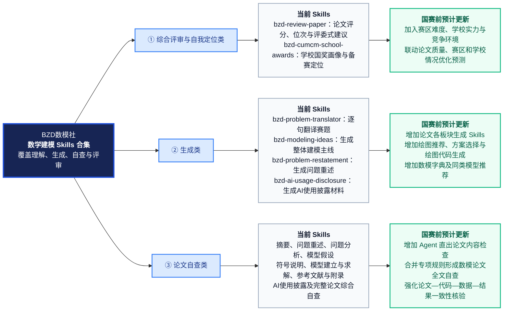
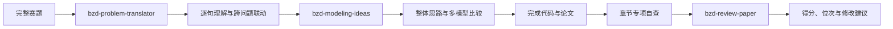

# BZD Math Modeling Skills

面向数学建模竞赛的 BZD Skills 合集，支持 **Codex** 与 **Claude Code**。

本项目围绕数学建模竞赛的完整流程持续研发，目前覆盖赛题理解、整体建模思路生成、论文板块写作、全文评审、章节自查、AI 工具使用披露、高校国奖数据查询及个人备赛定位。相关 Skills 主要基于 2020—2025 年高教社杯全国大学生数学建模竞赛赛题、评分细则、评分要点、评阅概述及完整评阅流程进行归纳和蒸馏。

> 本项目不是竞赛官方工具。所有评分、位次预测和备赛建议仅供参考，最终应以当届组委会及赛区发布的正式规则为准。

## Skills 分类

部分 Skill 同时支持生成、检查或综合评审，因此会在不同分类中重复出现，并在对应分类目录中各保留一份，方便用户按使用场景直接选择和安装。

### 一、综合评审与自我定位类

| Skill | 主要作用 | 输入 | 输出 |
|---|---|---|---|
| [`bzd-review-paper`](skills/综合评审与自我定位类/bzd-review-paper/) | 根据赛题制定评分细则并模拟竞赛评审 | 竞赛类型、完整赛题、完整论文 | 百分制得分、预估位次、详细扣分、HTML 评审报告 |
| [`bzd-cumcm-school-awards`](skills/综合评审与自我定位类/bzd-cumcm-school-awards/) | 查询高校五年国奖数据并评估个人备赛差距 | 学校名称、赛区及个人竞赛经历 | 高校国奖画像、2026 年预测及备赛建议 |

#### 国赛前预期更新

- 在 `bzd-review-paper` 中加入赛区难度差异、参赛规模和奖项竞争强度等因素，继续优化评分与位次预测逻辑；
- 将 `bzd-cumcm-school-awards` 的学校历史表现、赛区环境和个人备赛经历与论文评审结果进一步联动；
- 使论文点评更加准确、直接和直观，并能结合赛区情况与学校情况解释参赛者的实际竞争位置。

### 二、生成类

| Skill | 主要作用 | 输入 | 输出 |
|---|---|---|---|
| [`bzd-problem-translator`](skills/生成类/bzd-problem-translator/) | 逐句翻译赛题，识别隐藏条件和跨问题关系 | 完整赛题及附件说明 | 题意翻译报告、跨问题联动链 |
| [`bzd-modeling-ideas`](skills/生成类/bzd-modeling-ideas/) | 生成贯穿全文的建模主线并比较可行模型 | 完整赛题、附件、可选题意报告 | 多模型比较、选型理由、创新与验证方案 |
| [`bzd-problem-restatement`](skills/生成类/bzd-problem-restatement/) | 根据赛题生成问题重述，也支持已有重述自查 | 完整赛题；自查时另提供已有重述 | 问题背景、问题回顾、研究综述或自查报告 |
| [`bzd-ai-usage-disclosure`](skills/生成类/bzd-ai-usage-disclosure/) | 生成或检查 AI 工具使用声明及使用详情 | 论文、真实 AI 使用情况、已有声明或详情材料 | AI 工具使用声明、使用详情文档、自查结果 |

#### 国赛前预期更新

- 增加数学建模论文各板块的生成型 Skills；
- 生成型 Skills 采用普通 Skill 形式，可独立调用，也可配合智能体针对对应板块完善内容；
- 增加“绘图推荐 Skill”：用户输入赛题背景和结果数据后，获得多种可视化方案、图形选择理由及版式建议；用户确认方案后，可继续生成绘图代码；
- 持续完善生成内容与真实数据、模型、结果和全文逻辑的一致性检查。

### 三、论文自查类

| Skill | 自查对象 | 输入 | 输出 |
|---|---|---|---|
| [`bzd-abstract-checker`](skills/论文自查类/bzd-abstract-checker/) | 摘要 | 摘要，可选题目与关键词 | 严重问题警告、逐项诊断、优先修改建议 |
| [`bzd-problem-restatement`](skills/论文自查类/bzd-problem-restatement/) | 问题重述 | 完整赛题与已有问题重述 | 任务遗漏、条件失真、章节越界及修改建议 |
| [`bzd-problem-analysis-checker`](skills/论文自查类/bzd-problem-analysis-checker/) | 问题分析 | 完整赛题、附件说明与已有问题分析 | 任务映射、跨问联动、问题清单及修改优先级 |
| [`bzd-model-assumption-checker`](skills/论文自查类/bzd-model-assumption-checker/) | 模型假设 | 完整赛题、模型假设，可选模型正文 | 逐条诊断、遗漏假设、验证要求及修改优先级 |
| [`bzd-symbol-notation-checker`](skills/论文自查类/bzd-symbol-notation-checker/) | 符号说明 | 完整论文，或符号表与模型正文 | 符号遗漏、冲突、单位、上下标及版式诊断 |
| [`bzd-model-solution-checker`](skills/论文自查类/bzd-model-solution-checker/) | 模型建立、求解、检验和灵敏度分析 | 完整赛题、论文，可选附件或代码 | 核心正文诊断、复现检查及优先修改建议 |
| [`bzd-ai-usage-disclosure`](skills/论文自查类/bzd-ai-usage-disclosure/) | AI 工具使用声明与详情 | 论文、真实 AI 使用记录、已有披露材料 | 完整性、一致性、匿名性及责任边界检查 |
| [`bzd-reference-appendix-checker`](skills/论文自查类/bzd-reference-appendix-checker/) | 参考文献与附录 | 论文、参考文献、附录、程序与支撑材料 | 引用与附录检查报告、P0—P3 风险及修改建议 |
| [`bzd-review-paper`](skills/论文自查类/bzd-review-paper/) | 完整论文综合自查 | 竞赛类型、完整赛题与完整论文 | 综合得分、预估位次、评委式评价及修改顺序 |

#### 国赛前预期更新

- 增加 Agent 形式的论文内容检查能力，对论文、代码、数据和结果进行跨文件核验；
- 增加“数学建模论文全文自查”能力，将现有章节自查 Skills 的关键规则整合为一次完整检查；
- 在保留专项 Skill 深度的同时，输出全文级问题地图、风险等级和统一修改优先级；
- 加强图表、公式、结果、代码和正文结论之间的一致性检查。

### 四、数据查询与备赛辅助类

| Skill | 主要作用 | 输入 | 输出 |
|---|---|---|---|
| [`bzd-cumcm-school-awards`](skills/综合评审与自我定位类/bzd-cumcm-school-awards/) | 查询高校历史国奖数据并评估备赛距离 | 学校、赛区、竞赛经历和模拟情况 | 学校画像、国奖预测、省奖与国奖备赛建议 |

## 其他国赛前规划



该路线图用于展示当前已经上线的能力与国赛前计划更新内容。具体上线顺序将根据实际开发和测试结果调整。
### 当前能力与国赛前更新路线图

### 数模字典 Skill

计划建设“数模字典 Skill”，整理大量数学模型的：

- 大白话原理讲解；
- 使用条件与适用范围；
- 输入、输出与关键假设；
- 模型优势、缺陷和常见误用；
- 检验方法与改进方向；
- 同类型替代模型和对比建议。

用户描述问题并给出拟选模型后，Skill 将判断模型选择的可行性，指出适用条件是否满足，并推荐可以比较或替换的同类型模型。

### 数模资料

仓库已在 [`数模资料/`](数模资料/) 中整理以下内容：

- [`2026年数学建模竞赛模板-简洁版.docx`](数模资料/2026年数学建模竞赛模板-简洁版.docx)；
- [`2026年数学建模竞赛模板-BZD数模社(证书签名).pdf`](<数模资料/2026年数学建模竞赛模板-BZD数模社(证书签名).pdf>)；
- [`数学建模竞赛论文latex模板-BZD数模社 (1).zip`](<数模资料/数学建模竞赛论文latex模板-BZD数模社 (1).zip>)；
- [`官方评阅细则评分要点-参考示例-完整训练使用近五年16道题目.zip`](数模资料/官方评阅细则评分要点-参考示例-完整训练使用近五年16道题目.zip)；
- [`数学建模论文百分制评分观察点.pdf`](数模资料/数学建模论文百分制评分观察点.pdf)；
- [`各板块详细说明文档/`](数模资料/各板块详细说明文档/)：包含摘要、问题重述、问题分析、模型假设、符号说明、模型建立与求解、模型总结、参考文献与附录、AI 工具使用声明与详情等材料。

完整文件索引、用途和适用范围见 [`数模资料/README.md`](数模资料/README.md)。后续仅增加公开、自主整理或具有明确传播授权的备赛资料。

## 当前 Skills 总览

| Skill | 综合评审 | 内容生成 | 论文自查 | 数据查询 |
|---|:---:|:---:|:---:|:---:|
| `bzd-review-paper` | ✓ |  | ✓ |  |
| `bzd-cumcm-school-awards` | ✓ |  |  | ✓ |
| `bzd-problem-translator` |  | ✓ |  |  |
| `bzd-modeling-ideas` |  | ✓ |  |  |
| `bzd-problem-restatement` |  | ✓ | ✓ |  |
| `bzd-ai-usage-disclosure` |  | ✓ | ✓ |  |
| `bzd-abstract-checker` |  |  | ✓ |  |
| `bzd-problem-analysis-checker` |  |  | ✓ |  |
| `bzd-model-assumption-checker` |  |  | ✓ |  |
| `bzd-symbol-notation-checker` |  |  | ✓ |  |
| `bzd-model-solution-checker` |  |  | ✓ |  |
| `bzd-reference-appendix-checker` |  |  | ✓ |  |

## 推荐工作流



## 安装

### Codex

下载仓库后，将需要使用的 Skill 文件夹复制到：

```text
Windows：%USERPROFILE%\.codex\skills\
macOS/Linux：~/.codex/skills/
```

仓库中的中文目录用于功能分类。安装时既可以按分类选择，也可以进入分类目录复制具体的 `bzd-...` Skill 文件夹。若多个分类中出现同名 Skill，它们是相同能力的场景化副本；安装到同一个 Skills 目录时只需保留其中一份。

例如安装全部 Skills：

```text
.codex/skills/
├── bzd-abstract-checker/
├── bzd-ai-usage-disclosure/
├── bzd-cumcm-school-awards/
├── bzd-model-assumption-checker/
├── bzd-model-solution-checker/
├── bzd-modeling-ideas/
├── bzd-problem-analysis-checker/
├── bzd-problem-restatement/
├── bzd-problem-translator/
├── bzd-reference-appendix-checker/
├── bzd-review-paper/
└── bzd-symbol-notation-checker/
```

### Claude Code

将需要使用的 Skill 文件夹复制到：

```text
项目目录/.claude/skills/
```

同样应复制具体的 `bzd-...` Skill 文件夹，并在安装后保持 Skill 目录直接位于 `.claude/skills/` 下。

评审 Skill 的 Claude Code 补充配置见 [`integrations/claude-code/`](integrations/claude-code/)。

## 调用示例

### 翻译赛题

```text
使用 $bzd-problem-translator 翻译以下完整赛题：<赛题路径>
```

### 生成整体建模思路

```text
使用 $bzd-modeling-ideas 分析以下完整赛题：<赛题路径>
请生成贯穿全文的整体思路，并比较每一问的可行模型和选型理由。
```

### 生成或检查问题重述

```text
使用 $bzd-problem-restatement，根据以下完整赛题生成问题重述：
赛题：<赛题路径>
```

```text
使用 $bzd-problem-restatement 检查：
原始赛题：<赛题路径>
我的问题重述：<问题重述内容>
```

### 检查问题分析

```text
使用 $bzd-problem-analysis-checker 检查：
原始赛题：<赛题路径>
附件说明：<附件路径或说明>
我的问题分析：<问题分析内容>
```

### 评审完整论文

```text
使用 $bzd-review-paper 评审：
竞赛类型：<高教社杯国赛或其他竞赛名称>
赛题：<赛题路径>
论文：<论文路径>
```

### 检查参考文献与附录

```text
使用 $bzd-reference-appendix-checker 检查：
论文：<论文路径>
参考文献原始资料：<文献文件或链接>
附录与支撑材料：<材料文件夹路径>
程序代码：<代码文件夹路径>
```

## 项目结构

```text
bzd-math-modeling-skills/
├── README.md
├── CHANGELOG.md
├── skills/
│   ├── 综合评审与自我定位类/
│   │   ├── bzd-review-paper/
│   │   └── bzd-cumcm-school-awards/
│   ├── 生成类/
│   │   ├── bzd-problem-translator/
│   │   ├── bzd-modeling-ideas/
│   │   ├── bzd-problem-restatement/
│   │   └── bzd-ai-usage-disclosure/
│   └── 论文自查类/
│       ├── bzd-abstract-checker/
│       ├── bzd-ai-usage-disclosure/
│       ├── bzd-problem-analysis-checker/
│       ├── bzd-problem-restatement/
│       ├── bzd-model-assumption-checker/
│       ├── bzd-symbol-notation-checker/
│       ├── bzd-model-solution-checker/
│       ├── bzd-reference-appendix-checker/
│       └── bzd-review-paper/
├── integrations/
│   └── claude-code/
└── 数模资料/
```

## 重要说明

- 本项目不是竞赛官方工具，输出不代表官方评审结果、实际排名或奖项承诺；
- 没有真实附件数据时，不应虚构模型参数、最优结果、程序运行情况和预测精度；
- 使用者应自行确认当届竞赛关于 AI 工具、论文格式、附录材料和学术诚信的最新规定；
- 请勿向公开仓库提交未公开论文、个人身份信息、API Key、Token 或无传播授权的内部材料；
- 仓库中的评分规则、历史数据和经验阈值可能随竞赛年份发生变化。
- 同一 Skill 在多个分类目录中保留副本时，维护者应同步更新所有同名副本，避免不同分组中的版本发生偏差。

## 联系方式

✨ 如需进一步详细的论文检查、赛中资料等服务，可关注 **BZD数模社** 官网：[https://bzdshumo.com/](https://bzdshumo.com/)

- QQ数模交流群（主群1）：689964173
- QQ数模交流2群（主群2）：275032074
- 资料通知群（仅推送资料/无聊天）：928949323
- 微信（个性化定制）：bzdsxjm521
- 备用微信：bzdsxjm520 / BZD661188
