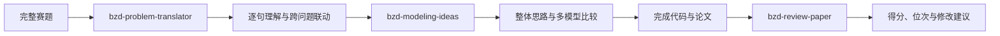

# BZD Math Modeling Skills

面向数学建模竞赛的 BZD Skills 合集，支持 Codex 与 Claude Code。
本项目围绕数学建模竞赛的完整流程进行研发，目前覆盖赛题逐句理解、跨问题关系梳理、整体建模思路生成、多模型比较与选型、论文评审、竞赛位次预估、高校国奖数据查询及个人备赛进度评估。
相关 Skills 主要基于2020—2025年高教社杯全国大学生数学建模竞赛赛题、评分细则、评分要点、评阅概述及完整评阅流程进行归纳和蒸馏。
后续将继续增加数据预处理、模型验证、代码检查、论文写作和图表审查等数学建模 Skills。
## Skills

| Skill | 主要作用 | 输入 | 输出 |
|---|---|---|---|
| [`bzd-problem-translator`](skills/bzd-problem-translator/) | 逐句解释赛题，识别隐含条件和跨问关系 | 完整赛题及附件说明 | 题意翻译报告、跨问题联动链 |
| [`bzd-modeling-ideas`](skills/bzd-modeling-ideas/) | 生成贯穿全文的建模主线并比较可行模型 | 赛题、附件、可选题意报告 | 多模型比较、选型理由、创新与验证方案 |
| [`bzd-review-paper`](skills/bzd-review-paper/) | 根据赛题制定细则并评审论文 | 竞赛类型、完整赛题、完整论文 | 百分制得分、预估位次、HTML评审报告 |
| [`bzd-cumcm-school-awards`](skills/bzd-cumcm-school-awards/) | 查询高校五年国奖数据并评估个人备赛差距 | 学校名称、赛区及个人竞赛经历 | 高校国奖画像、2026预测及备赛建议 |
| [`bzd-abstract-checker`](skills/bzd-abstract-checker/) | 仅输入摘要，检查独立阅读性及具体写作问题 | 数学建模论文摘要，可选题目与关键词 | 严重问题警告、逐项观察、问题清单及优先修改建议 |
| [`bzd-problem-restatement`](skills/bzd-problem-restatement/) | 根据赛题生成问题重述，或对照原题检查已有重述 | 完整赛题；自查时另提供问题重述 | 研究背景、问题回顾、研究综述，或分级问题清单 |
| [`bzd-problem-analysis-checker`](skills/bzd-problem-analysis-checker/) | 对照赛题检查问题分析的建模逻辑与章节边界 | 完整赛题、附件说明、已有问题分析 | 任务映射、联动核对、问题清单及修改优先级 |
| [`bzd-model-assumption-checker`](skills/bzd-model-assumption-checker/) | 对照赛题诊断模型假设的合理性、依据及建模用途 | 完整赛题、模型假设，可选提供模型正文 | 逐条诊断、遗漏假设、验证要求及修改优先级 |
| [`bzd-symbol-notation-checker`](skills/bzd-symbol-notation-checker/) | 对照完整论文检查符号说明表及全文符号体系 | 完整论文，或符号表与模型正文 | 符号遗漏、冲突、单位、上下标、正文一致性及版式诊断 |
| [`bzd-model-solution-checker`](skills/bzd-model-solution-checker/) | 检查模型建立、求解、检验及灵敏度分析是否完整、合理且可复现 | 完整赛题、完整论文及可选附件或代码 | 模型建立与求解诊断、验证与灵敏度分析诊断、优先修改建议 |
| [`bzd-ai-usage-disclosure`](skills/bzd-ai-usage-disclosure/) | 生成或检查AI工具使用声明及使用详情 | 论文、真实AI使用情况、已有声明或详情材料 | AI工具使用声明、使用详情文档、自查结果 |
| [`bzd-reference-appendix-checker`](skills/bzd-reference-appendix-checker/) | 检查参考文献、附录长度、支撑材料和程序复现情况 | 完整论文、参考文献、附录、程序与支撑材料 | 文献与附录检查报告、P0—P3风险及修改建议 |
## Skills 介绍

### BZD-review-paper

面向数学建模竞赛论文的智能评审 Skill，支持 **Codex** 与 **Claude Code**。本项目使用2020—2025年16道高教社杯全国大学生数学建模竞赛题目的评分细则、评分要点、评阅概述及完整评阅流程蒸馏形成，主要适用于高教社杯国赛论文评审。

用户只需提供完整赛题和参赛论文，Skill 会先根据赛题独立制定百分制评分细则，再对论文逐项评审，计算最终得分与竞赛位次，并生成可直接查看、打印或保存为 PDF 的 HTML 评审报告。

### Modeling Ideas

Modeling Ideas 是一款基于过去五年国赛赛题与评委标准答案蒸馏而成的思路生成工具。输入题干后，它不直接给出单一答案，而是先将题目翻译为“已知 x、构建 f(x)、输出 y”的直白概述，再输出一张多模型并行思路表格——每个问题提供数个可贯穿全文、前后联动的候选模型，同时生成流程框架图与创新点建议。

其核心逻辑是：建模不是“拿到一个思路就做”，而是先并行头脑风暴、对比择优，从而摆脱 AI 思路同质化，建立真正具备全局联动性的解题方向。用户提供完整赛题及附件后，Skill 会先从全题角度重建问题之间的数据流、模型依赖和结果传递关系，再针对每一问生成多种可行建模方案，比较模型的适用条件、优势、局限和验证方法，并给出推荐模型及选用理由。

### bzd-problem-translator

国赛题目中的每一句话都不是“废话”，往往隐含着建模条件、数据口径、求解目标或问题之间的联动关系。基于近年来国赛赛题、评阅要点及命题人相关讲解，我们研发了题意翻译 Skill，帮助参赛者逐句理解题目、识别隐藏条件、梳理跨问题逻辑，避免因漏读或误解题意影响建模方向。

调用 Skill 并输入题目，即可得到该题目的逐句翻译解释。
### bzd-abstract-checker

`bzd-abstract-checker` 是一款面向数学建模论文摘要的智能自查
Skill。用户只需提供摘要，无需同时提供赛题或论文正文，即可获得摘要问题诊断。

Skill 首先将摘要交给“非本研究方向的读者”进行独立阅读性判断，检查读者能否脱离论文正文，明确获知论文研究了什么问题、采用了什么模型或方法、得到了什么结果。

如果研究问题、主要方法或关键结果存在实质性缺失，Skill 会首先输出严重警告；随后从模型与算法、量化结果、模型检验、创新表达、分问题结构、语言规范、关键词和篇幅风险等方面逐项检查，并列出最优先修改的内容。

由于调用时不要求提供赛题和论文正文，对于“是否覆盖全部赛题”“数值是否与正文一致”等无法仅凭摘要判断的内容，Skill 会明确标记为“无法仅凭摘要核验”，避免作出没有依据的判断。
### bzd-problem-restatement

面向数学建模论文“问题重述”章节的生成与自查 Skill。

生成模式下，用户只需提供完整赛题，Skill 即可在忠实保留题意、约束条件和任务边界的基础上，生成由研究背景、问题回顾和研究综述组成的问题重述。内容不会提前写入具体模型、算法、求解过程和计算结果，也不会虚构参考文献。

自查模式下，用户提供原始赛题和自己撰写的问题重述，Skill 将检查任务是否遗漏、条件是否失真、是否照抄题目、是否提前泄露模型与结果，以及研究综述是否规范，并给出分级问题清单和修改建议。
### bzd-model-assumption-checker

面向数学建模论文“模型假设”章节的专项自查 Skill。

用户提供完整赛题和论文中的模型假设后，Skill 会从赛题中重建研究对象、任务要求、关键条件和核心因素，并逐条判断假设的来源、必要性、合理性、依据要求及后续建模用途。

Skill 重点检查以下问题：

- 是否遗漏题目明确给出的关键条件；
- 是否通过假设删除了题目要求研究的核心因素；
- 是否存在模型必然正确、指标必然全面等循环论证；
- 数据假设是否与实际数据处理过程矛盾；
- 分布、独立性、线性和平稳性等强假设是否具有依据；
- 是否把数据处理操作或求解算法误写成模型假设；
- 是否存在重复、空泛、过度理想化或没有后文用途的假设；
- 每条假设是否能对应后续模型、参数、公式、约束、检验或局限分析。

输出包括赛题关键前提核对、逐条诊断、遗漏假设候选、强假设验证要求、后文对应关系和修改优先级。


### bzd-problem-analysis-checker

面向数学建模论文“问题分析”章节的专项自查 Skill。

用户提供完整赛题、附件说明和自己撰写的问题分析后，Skill 将逐问检查任务理解、已知条件、输入输出、数据处理依据、模型类别判断、模型选用理由、问题间联动关系、验证思路以及章节边界。

输出包括赛题任务映射、总体评价、逐问检查结果、跨问题联动核对、分级问题清单和修改优先级，帮助使用者发现问题分析中存在的逻辑跳跃、依据不足、模型堆砌和提前出现结果等问题。
### bzd-model-solution-checker

面向数学建模论文核心正文的自查 Skill。用户提供完整赛题和论文后，Skill 将检查数据处理、模型选择、模型建立、目标函数与约束、求解算法、参数设置、结果呈现、模型检验、灵敏度分析、稳健性分析及跨问题联动是否完整、合理且可复现。

当用户同时提供附件数据、源程序或运行结果时，Skill 还会进一步核对数据、代码、模型和论文结果之间的一致性；缺少必要材料时，不会虚构数值验证结论。
### bzd-model-assumption-checker

面向数学建模论文“模型假设”章节的专项自查 Skill。

用户提供完整赛题和论文中的模型假设后，Skill 会从赛题中重建研究对象、任务要求、关键条件和核心因素，并逐条判断假设的来源、必要性、合理性、依据要求及后续建模用途。

Skill 重点检查以下问题：

- 是否遗漏题目明确给出的关键条件；
- 是否通过假设删除了题目要求研究的核心因素；
- 是否存在模型必然正确、指标必然全面等循环论证；
- 数据假设是否与实际数据处理过程矛盾；
- 分布、独立性、线性和平稳性等强假设是否具有依据；
- 是否把数据处理操作或求解算法误写成模型假设；
- 是否存在重复、空泛、过度理想化或没有后文用途的假设；
- 每条假设是否能对应后续模型、参数、公式、约束、检验或局限分析。

输出包括赛题关键前提核对、逐条诊断、遗漏假设候选、强假设验证要求、后文对应关系和修改优先级。
### BZD AI Usage Disclosure

BZD AI Usage Disclosure 是一款面向数学建模竞赛的 AI 工具使用声明生成与自查 Skill。它依据用户提供的论文、AI 工具名称、实际使用环节、留存记录及人工核验方式，生成规范的《AI工具使用声明》和《AI工具使用详情》，也可以检查参赛队已经撰写的声明是否真实、完整且与论文内容一致。

Skill 覆盖数据预处理、模型设计、代码生成与调试、结果检验、图表绘制和论文写作等常见 AI 使用场景。对于模型版本不明确、提示词未保存或代码文件无法准确追溯的情况，Skill 会明确说明信息缺失，不虚构模型名称、提示词、操作记录或人工验证过程；同时区分 AI 建议、参赛队实际采纳内容、人工修改过程和最终核验方法，帮助参赛队形成可追溯、可核验的使用记录。

用户既可以输入论文和真实 AI 使用情况，直接生成声明与详情材料；也可以同时提供自己撰写的《AI工具使用声明》或《AI工具使用详情》，检查是否存在使用范围遗漏、描述过度笼统、事实不一致、验证过程不足、身份信息泄露或责任边界不清等问题。最终可输出适合直接加入论文的声明文本，以及可编辑、打印或转换为 PDF 的详细使用记录。

> 本 Skill 仅辅助整理和检查 AI 工具使用情况，不代替竞赛官方审查。参赛队应如实披露实际使用过程，并以当届竞赛发布的 AI 使用规定和论文格式要求为准。
### bzd-symbol-notation-checker

面向数学建模论文“符号说明”章节的专项自查 Skill。

用户提供完整论文后，Skill 会提取符号说明表，并与正文中的变量、参数、集合、下标、公式和单位进行对照，判断符号表是否完整、准确、统一且具有实际检索价值。

Skill 重点检查：

- 是否收录全文反复使用的核心变量、参数、集合和下标；
- 是否混入只出现一次的临时变量、普通运算符或程序内部变量；
- 每个符号的含义是否具体完整；
- 有量纲变量是否标明单位；
- 单位是否与正文、公式和数据口径一致；
- 同一符号是否承担多个含义；
- 同一变量是否使用多个不同符号；
- 大小写、粗体、向量、矩阵和集合是否正确区分；
- 上下标含义是否前后一致；
- 符号表中的符号是否在正文实际使用；
- 正文反复出现的核心符号是否被遗漏；
- 符号首次出现时是否进行就近解释；
- 自定义指标、修正系数和创新概念是否具有明确的定义；
- 三线表、表题、列宽、对齐和跨页排版是否合理。

输出包括总体评价、逐条符号诊断、正文遗漏符号、冗余符号、符号冲突、单位与量纲问题、首次定义问题和修改优先级。
### BZD Reference Appendix Checker

BZD Reference Appendix Checker 是一款面向数学建模论文参考文献与附录的联合自查 Skill。用户提供论文、参考文献、附录、程序和支撑材料后，Skill 会检查正文引用与文末条目是否对应，判断文献的真实性、完整性、相关性和格式一致性，并检查 AI 工具是否被错误列入参考文献。

参考文献通常建议控制在5—15篇。Skill 不会单纯按照数量判断质量：少于5篇时重点检查理论、算法和数据来源是否缺失；超过15篇时重点检查重复、凑数和弱相关文献。

对于附录，Skill 会统计正文与附录页数及二者比例，检查是否存在重复正文内容、无关代码、调试日志或低价值中间结果。在当届规则没有明确页数上限时，默认将“附录不超过正文页数约一半”作为精简性建议，但不会为了压缩页数而删除必要源程序和复现材料。

Skill 还会检查程序能否运行，以及论文公式、参数、约束、代码和结果是否一致，同时排查文件名、代码注释、本地路径、文档属性和支撑材料中的身份或敏感信息，并按照P0—P3风险等级输出修改建议。
### bzd-cumcm-school-awards

基于2021—2025年高教社杯全国大学生数学建模竞赛国奖数据，查询高校历年一等奖、二等奖及国奖总数，并输出工作簿提供的2026年国奖预测和历史获奖队伍中的高频指导教师。

Skill 还可结合学生参加其他数学建模竞赛的次数、获奖情况、完整模拟次数及目标奖项，评估其距离省奖和国奖所需补充的准备工作。大家可以自行在 官网 https://bzdshumo.com/   国赛资料-国奖名额查询 输入自己学校查询

> 2026年预测及相关概率均为经验模型结果，仅供备赛参考，不代表官方名额、实际排名或获奖承诺。
> ```mermaid
flowchart LR
    A["输入学校与赛区"] --> B["bzd-cumcm-school-awards"]
    B --> C["高校五年国奖画像"]
    C --> D["补充个人竞赛经历"]
    D --> E["省奖与国奖备赛距离评估"]
    E --> F["练习、复盘与论文改进"]

## 推荐工作流



## 安装

### Codex

下载仓库后，将需要的 Skill 文件夹复制到：

```text
Windows：%USERPROFILE%\.codex\skills\
macOS/Linux：~/.codex/skills/
```

安装全部后，目录示例：

```text
bzd-math-modeling-skills/
├── README.md
├── CHANGELOG.md
├── skills/
│   ├── bzd-problem-translator/
│   ├── bzd-modeling-ideas/
│   ├── bzd-review-paper/
│   ├── bzd-abstract-checker/
│   ├── bzd-cumcm-school-awards/
│   ├── bzd-problem-restatement/
│   ├── bzd-problem-analysis-checker/
│   └── bzd-model-assumption-checker/
└── integrations/
    └── claude-code/
```

### Claude Code

将需要的 Skill 文件夹复制到：

```text
项目目录/.claude/skills/
```

评审 Skill 的Claude Code补充配置见 [`integrations/claude-code/`](integrations/claude-code/)。

## 调用示例

```text
使用 $bzd-problem-translator 翻译以下完整赛题：<赛题路径>
```

```text
使用 $bzd-modeling-ideas 分析以下完整赛题：<赛题路径>
请生成贯穿全文的整体思路，并比较每一问的可行模型和选型理由。
```
使用 $bzd-problem-analysis-checker 检查：

原始赛题：<赛题文件路径>
附件说明：<附件路径或附件说明>
我的问题分析：<问题分析内容>
使用 $bzd-problem-restatement 检查：

原始赛题：<赛题文件路径>
我的问题重述：<问题重述内容>
### 生成问题重述

```text
使用 $bzd-problem-restatement，根据以下完整赛题生成问题重述：

赛题：<赛题文件路径>
```text
使用 $bzd-review-paper 评审：
竞赛类型：<是否为高教社杯国赛或其他竞赛名称>
赛题：<赛题路径>
论文：<论文路径>
```

## 项目结构

```text
bzd-math-modeling-skills/
├── README.md
├── CHANGELOG.md
├── skills/
│   ├── bzd-problem-translator/
│   ├── bzd-modeling-ideas/
│   ├── bzd-review-paper/
│   ├── bzd-abstract-checker/
│   ├── bzd-cumcm-school-awards/
│   ├── bzd-problem-restatement/
│   └── bzd-problem-analysis-checker/
└── integrations/
    └── claude-code/
```

## 重要说明

- 本项目不是竞赛官方工具，输出不代表官方评审结果或奖项承诺；
- 没有真实附件数据时，不应虚构模型参数、最优结果和预测精度；
- 使用者应自行确认竞赛关于AI工具、论文格式和学术诚信的最新规定；
- 请勿向公开仓库提交未公开论文、个人身份信息、API Key或无传播授权的内部材料。

## 联系方式

✨ 如需进一步详细的论文检查、赛中资料等服务，可关注 **BZD数模社** 官网：[https://bzdshumo.com/](https://bzdshumo.com/)

- QQ数模交流群（主群1）：689964173
- QQ数模交流2群（主群2）：275032074
- 资料通知群（仅推送资料/无聊天）：928949323
- 微信（个性化定制）：bzdsxjm521
- 备用微信：bzdsxjm520 / BZD661188
