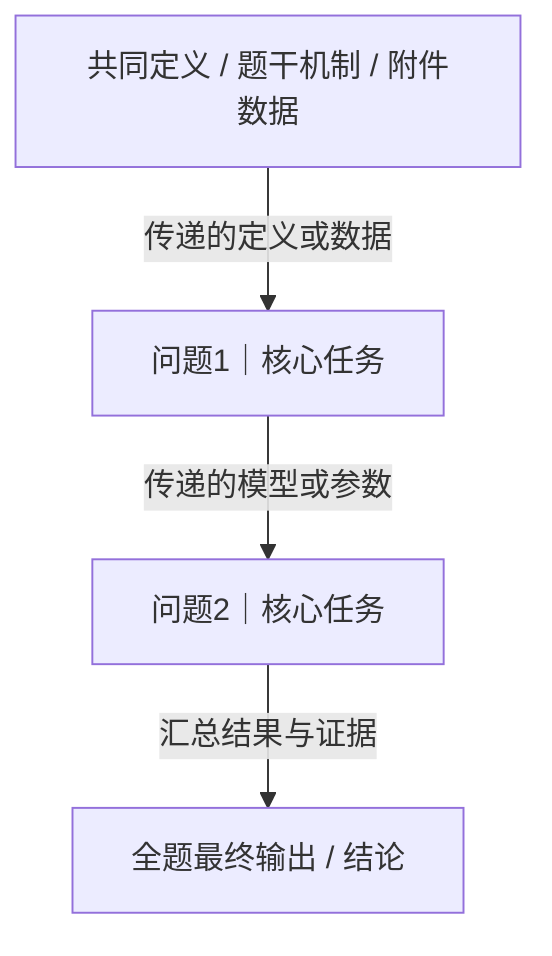

# Markdown Output Standard

Create one UTF-8 Markdown file named `<题号或题名>-题意逐句翻译.md`. Use a concise filesystem-safe title. Do not paste the full analysis into chat when the file can be created.

## Required heading order

1. `# 题目名称`
2. `## 0. 小学应用题式题意还原` — Huawei Cup only; omit this heading entirely for other contests
3. `## 1. 整题概览`
4. `## 2. 逐句题意翻译与联动表`
5. `## 3. 核心术语与口径表`
6. `## 4. 各问输入—任务—输出表`
7. `## 5. 跨问题联动链`
8. `## 6. 最容易漏读或误解的句子`
9. `## 7. 完整性核验`

## Section requirements

### 0. 小学应用题式题意还原（仅华为杯）

Follow `cpgmcm-plain-language-translation.md`. Include four parts in this order:

1. **一句话版** — at most 40 characters, zero subject-specific terms.
2. **小学应用题版** — one continuous word problem within 400 characters, sub-questions numbered to match the original questions one-to-one, immediately followed by the verbatim warning line:

   > ⚠️ 本节是帮助理解的类比版本，已丢失精度，**不可作为建模与求解依据**。实际建模必须回到第 3 节逐句翻译表与原始题面。

3. **术语生活化映射表**:

   | 原文专业术语 | 生活化替身 | 这个替身丢掉了什么 | 对应小问 |
   |---|---|---|---|

   The third column is mandatory for every row; `无` is not acceptable.

4. **背景知识补课卡**:

   | 需要补的背景 | 三句话说明 | 不懂会影响哪一问 |
   |---|---|---|

   Write `无` only when the problem genuinely assumes no unexplained background.

### 1. 整题概览

Include the source filename, actual problem-title anchor, one-paragraph whole-problem translation, question progression, and excluded pre-title boilerplate as an audit note.

### 2. 逐句题意翻译与联动表

Use this Markdown table:

| 编号 | 题干原句 | 通俗而精确的翻译 | 明示条件/数据 | 隐含建模信号 | 与前后内容的联动 | 漏读后果 | 后文必须出现的证据 | 来源页码/位置 |
|---|---|---|---|---|---|---|---|---|

Create one row per substantive source unit. Preserve the exact source sentence; never replace it with an ellipsis.

### 3. 核心术语与口径表

| 术语 | 题目原始定义 | 建议采用的精确口径 | 单位/范围 | 影响问题 | 歧义或注意事项 |
|---|---|---|---|---|---|

### 4. 各问输入—任务—输出表

| 问题 | 直接输入 | 需要解决的任务 | 必须满足的约束 | 最终输出 | 依赖前问内容 | 将被后问复用的内容 |
|---|---|---|---|---|---|---|

### 5. 跨问题联动链

Use exactly one primary fenced Mermaid block. Do not replace it with a Markdown table or an image.

Adapt the graph to the actual problem rather than copying this linear example.

Flowchart rules:

- Represent every numbered question with a distinct node labeled `问题号｜核心任务`.
- Include shared definitions, mechanisms, and attachment-data nodes when they feed multiple questions.
- Label each edge with the transferred variable, model, constraint, result, or validation evidence.
- Use parallel branches for independent questions and convergence for shared conclusions.
- Draw a return edge when a later question validates, corrects, or updates an earlier result; label it `回流验证`, `修正结果`, or a more specific phrase.
- End at a concrete whole-problem deliverable.
- Use `subgraph` where it makes stages or parallel branches clearer.
- Quote node labels containing Chinese punctuation, brackets, slashes, or line breaks.
- Keep node IDs ASCII-only and unique.

After the diagram, include no cross-question edge table. A short paragraph explaining the most important loop or branch is allowed when the graph alone could be misread.

### 6. 最容易漏读或误解的句子

| 优先级 | 原句/关键词 | 常见误读 | 正确理解 | 影响问题 | 建议检查证据 |
|---|---|---|---|---|---|

### 7. 完整性核验

| 核验项目 | 结果 | 说明 |
|---|---|---|

Include source pages, substantive source-unit count, translation-row count, question count, attachments covered/missing, unresolved ambiguities, excluded pre-title boilerplate, OCR uncertainties, and no-omission conclusion. Include `跨问题联动链完整性` with `通过/不通过` and explicitly list all numbered questions represented in the Mermaid graph. Do not deliver when the result is `不通过`.

For Huawei Cup problems, add these verification rows: `应用题小问与原题小问一一对应`, `术语映射表第三列无空缺`, `应用题版未出现学科名词`, `约束方向与依赖顺序未失真`, and `免责提示行原文保留`. Each must read `通过` before delivery.

## Markdown formatting

- Use UTF-8 and a single H1.
- Escape literal `|` inside table cells as `\|`.
- Replace source line breaks inside table cells with ` `.
- Keep paragraphs concise; use bullets only when they improve scanning.
- Preserve numbers, units, symbols, negations, intervals, and attachment names exactly.
- Use inline LaTeX `$...$` or fenced math only when needed to preserve a formula or symbol accurately.
- Keep the Mermaid block self-contained and free of Markdown links or HTML.

## Optional HTML rendering

The `.md` file is the deliverable. When the user also asks for HTML, render it with `scripts/render_html.py <report.md>` rather than hand-writing markup, so the two views cannot drift apart.

The renderer relies on this standard being followed exactly. Keep to it or the rendering will be rejected:

- one H1 and `##` section headings in the required order;
- every table preceded by a header row and a separator row, with a constant cell count per row after escaped pipes are accounted for;
- literal `|` inside cells escaped as `\|`, and internal line breaks written as ` `;
- the Mermaid diagram in a fenced `mermaid` block containing no Markdown links or HTML;
- the warning line in section 0 written as a blockquote, separated from the word problem by a blank line so the two render as distinct blocks.

The renderer aborts with a non-zero exit code when it detects a lost table, a heading-count mismatch, an inconsistent row width, a dropped flowchart, or unrendered Markdown. Fix the Markdown and re-run; do not edit the HTML by hand.

## Verification

Before delivery:

1. Confirm generic pre-title boilerplate does not appear as a translated ledger row.
2. Confirm every substantive source unit appears exactly once and every numbered question appears in the input-task-output table.
3. Confirm the Mermaid block exists, starts with `flowchart`, uses unique node IDs, represents every numbered question, shows parallel/converging/return links when required, and contains a final-output node.
4. Confirm every Markdown table has a separator row and a consistent number of cells per row after escaped pipes are accounted for.
5. Confirm the file opens as UTF-8, contains no placeholder text, and exports as exactly one `.md` file.
6. For Huawei Cup problems, run the section-7 self-check in `cpgmcm-plain-language-translation.md` and confirm the sentence-level ledger is still complete rather than replaced by the plain-language layer. For other contests, confirm section 0 is absent.
